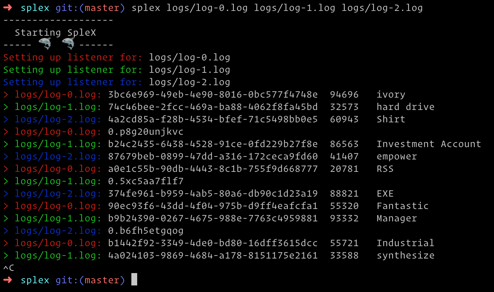
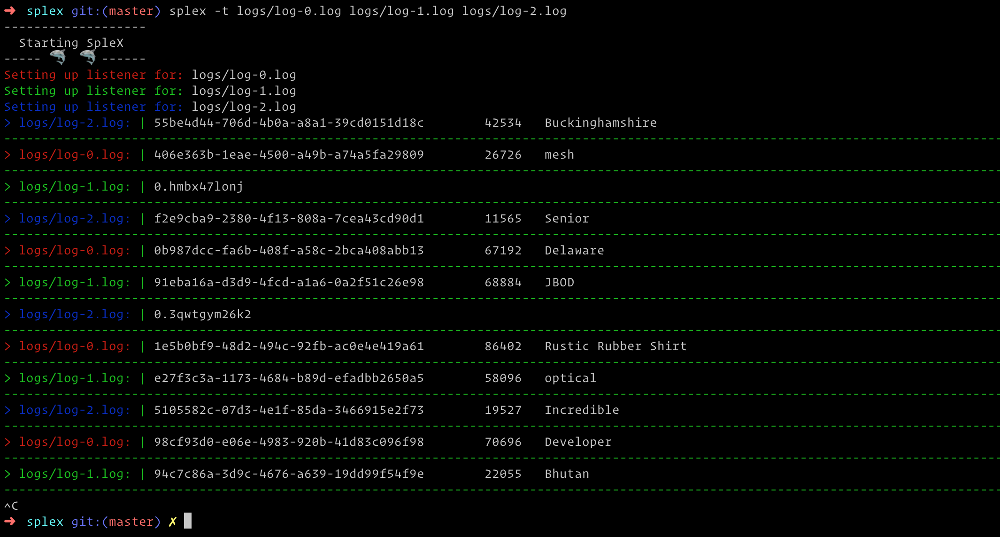
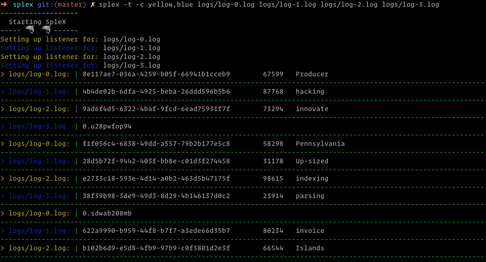

# Splex

[](https://GitHub.com/Naereen/StrapDown.js/issues/)
[](http://makeapullrequest.com)
[](https://github.com/kodi/splex/commit/)
[](http://hits.dwyl.io/kodi/splex)


[](https://lbesson.mit-license.org/)

## Instalation

To install globally, do:
```
npm i -g splex
```

## What is Splex
Need to watch 4 log files?

Tired of doing `tail -f log.file` in 4 terminal panels/tabs/windows?

Enter **Splex**

[](https://asciinema.org/a/264129)

Splex is a streaming log multiplexer for node.

Pass in multiple files as aguments, and watch them stream all at once in a single window, nicely color coded by log file, or even separated in table-like format for easier reading.


## Example commands

Basic usage

```
splex logs/log-0.log logs/path/log.1 logs/path/log.2
```


To have a table-like interface, add `-t` flag:

```
splex -t logs/log-0.log logs/log-1.log logs/log-2.log
```


To specify custom colors, eg. alternating yellow and blue:
```
splex -t -c yellow,blue logs/log-0.log logs/log-1.log logs/log-2.log logs/log-3.log
```



